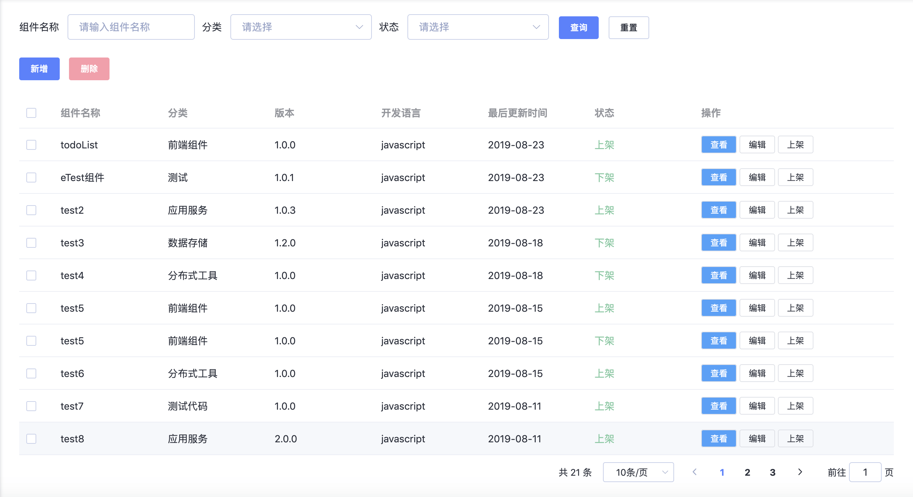

## 目录

- [**成果展示**](#成果展示)
  - [**视图对比**](#视图对比)
  - [**相关链接**](#相关链接)
  - [**详细成绩**](#详细成绩)
- [**挑战过程**](#挑战过程)
- [**思考&体会**](#思考&体会)
  - [**“自定义列表”**](#“自定义列表”)
  - [**部署静态网页**](#部署静态网页)
- [**结语**](#结语)

<hr>

## 成果展示

#### 视图对比

样图: 

demo: 

#### 相关链接

> [demo 预览链接：https://ggg50.github.io/FEMessage-demo…](https://ggg50.github.io/FEMessage-demo/dist/index.html#/el-data-table)  

(tips: 这个 demo 加载需要些时间，请耐心等待 …)

>[github 源码链接：https://github.com/ggg50/FEMessage-demo](https://github.com/ggg50/FEMessage-demo)  

>[在线yapi](https://kalagala.xyz/) (账户：`admin@admin.com` 密码：`123456`)

(tips: 这个加载也需要点时间)

>[数据处理脚本(yapi)](https://github.com/ggg50/FEMessage-demo/blob/master/yapi脚本.js)

另外，还有([后面会提到](#“自定义列表”))：  
>[slot-default-demo 预览链接](https://ggg50.github.io/FEMessage-demo/dist/index.html#/slot-default-demo)

>[slot-default-demo 源码链接](https://github.com/ggg50/FEMessage-demo/blob/master/src/pages/slot-default-demo.vue)

#### 详细成绩

0. 完全依赖提供的工具开发；  
1. 完成：搜索表单，顶部按钮，支持多选，分页，时间格式化，自定义操作列表按钮及样式；  
2. demo与样图尺寸上、排布上，不严格符合；“上架”、“下架”不同样式，没完成；也没来得及去处理自定义操作列的第三列（状态切换列）  
3. 有“删除”与“搜索”的 api,删除、搜索结果会保留，数据（包括 delete）都是通过 GET api 传过去（虽然这么做不符合规范），因为按我的理解，yapi 上面是没有数据库的。  
我注意到每次发送 delete 请求后还会有 get 请求刷新数据，我把参数通过 get api 传过去之后，在脚本里进行逻辑处理。  
“改”、“查”没做，也没有做弹出框(弹窗这部分，最近在学习 element-ui 的时候，已经知道如何实现了)  

4. travis-ci 以前做过，这次没时间做  
5. 部署 github pages，之前那三天里面没有部署成功，后面几天抽空试了试，可以用了；  
6. url参数为相对路径，没有完成，按照 readme.md 做，没成功，还没去探索原因；  
7. commit message ，感觉挺规范的 ……  

## 挑战过程

第一天，我花了一天的时间去搞明白，这个任务要我做什么， create-nuxt-app , yapi, el-data-table 是什么东西，以及如何使用，完成开发工具、el-data-table 的试用，还有 yapi 的部署和 api 测试；  

第二天，主要是想完成数据结构、数据交互逻辑，可能是因为最初理解这个组件原理有偏差，思维上饶了很多弯路，以及对于页面的响应效果追求太多（稳定的删除、查询效果），一直到第三天，后面觉得时间不太够就没做增、改功能；  

第三天，打算做 `自定义列表、状态列的样式、travis-ci 、简单文档 、发布 、yapi 在线部署` , 一开始以为这些是比较散的小事件，结果，每一步都碰到了一开始没考虑到的坑，最终，完成不了。  

## 思考&体会

依我浅见，这种灵活性大打折扣的组件的核心在于在特定的场景下非常实用，而且`容易上手`，外加`防呆`（不给小白惹麻烦的机会）。  
不过，从我一个小白的角度，在本次尝试实现样图中的各种需求的时候，实际体验中有一些不友好的地方。  

#### “自定义列表”

比如，在实现“自定义列表”的时候，一开始用 extraButtons 实现，同样可以实现 编辑、查看、状态 三列，但是这种做法有一个问题，默认提供的操作列，其中查看列与编辑列是顺序固定的，不符合样图的需求，于是跑去文档继续查，找了半天，整个文档对于自定义列表只有一个不是那么清楚的描述：  

```
(插槽) default： 自定义操作列, 当extraButtons不满足需求时可以使用
```

然后我就去试啊试，感觉上，说得那么简单，操作起来却“不成比例的麻烦”，试了几次 “default” 就是没有效果，跑去看插槽语法，自己的用法也没错，那错哪了呢？后面跑去看 el-data-table 源代码才知道，这个地方要用的是 `el-table-column`，原谅我在此之前没用过 element-ui ……  

试了试，It work! “历经坎坷”的我不免在心里嘀咕“省哪个例子都不应该省这个例子啊 …… ”。所以，我自己的收获是，假设我们不考虑“为了提升试题难度而有意为之”的话，对于 default 插槽需要用 `el-table-column` 这个注意事项应该提一提，事实上，我还觉得自定义操作列的例子应该补上，像我这样的小白很蠢的，有坑肯定会往里面跳 ……
于是，9月3日我有空去学 element-ui 的时候，用你们家提供的 api 小心翼翼地写了一个 [slot-default-demo](https://ggg50.github.io/FEMessage-demo/dist/index.html#/slot-default-demo)，希望你们用得到它 :)

#### 部署静态网页
另外，在尝试部署到 github pages 的时候也碰到一个阻碍，以往在使用工具的时候，它会让我这样…… 然后那样…… 然后当当当成功 ！  

我们在打包代码发布到 github 的时候，打包的结果用的是相对路径，这样会有一个问题，因为 github 产生的第一个 github pages( `https://<name>.github.io/` ) 跟后续的 github pages 有差异，后续的**路径需要加上一个仓库名** `https://<name>.github.io/<REPO>` ，所以，我们往往需要进行一些手动设置：  
比如 vue-cli，它会让我们在 vue.config.js 中设置 publicPath 为 `"/<REPO>/"`，然后就帮我们加在最终的路径上。  

我尝试了在 create-nuxt-app 中设置环境变量 **publicPath** 为 `/FEMessage-demo/dist/`，起效了，编译出来的路径跟着变了，不过，与此同时，编译出来的.js 文件又被放到了 dist 中的 `/FEMessage-demo/dist/` 目录下，这多少有点意外。于是，我不得不跑去把 .js 文件手动挪出来 ……  

我猜，那是因为，github pages 并不是这个工具在设计的时候主要考虑的应用场景吧，正常情况下，我们直接把 dist 文件内的东西拷贝到服务器上，似乎也没有通用的路径问题需要考虑。  

## 结语

本次挑战，对于我自己来说，一开始挺吃力的，很多陌生事物，感觉每走几步就会碰上一些意料之外的坑，然后在坑里东碰西撞，许久才得以找到方法爬出来 …… 慢慢用得有点顺手了，不过依然时间不够用。

也不知道这样的思考是否对于您有价值，我努力还原自己的实践体会。  
我自身倒是获益良多，在短时间内学会了几个新东西，而且，在后期仔细整理过程中，很多原本没注意、没搞明白的地方也通畅了。

着实是一次非常有意义的尝试，感谢！  

最后，我还是把自己的简历附上（邮件附件是 pdf 版），希望得到一个面试机会  

我的[在线简历](https://ggg50.github.io/resume/)  

谢嘉锋  
2019.9.8  
